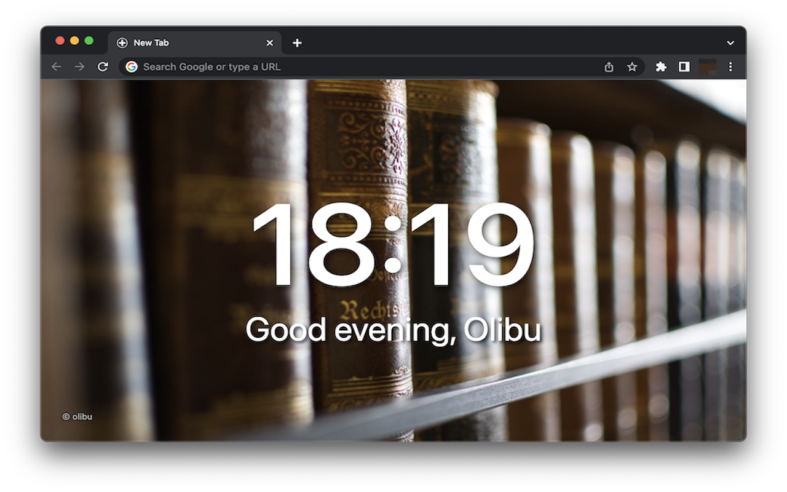

# 500 New Tabs

Chrome Extension to show pretty background images in new tabs from the 500px.com web page.



# Why another extension?

There are already a lot of such extensions. I've used [Moment](https://chrome.google.com/webstore/detail/moment-1-personal-dashboa/lgecddhfcfhlmllljooldkbbijdcnlpe) for a very long time. 500px.com has [it's own extension](https://chrome.google.com/webstore/detail/500px-photo-new-tab-inspi/clbaflfnbbbgjppjogdmnhkgpiijamdg) already. And even the default Chrome New Tab pages shows nice pictures.

So, why another extension?

There are a lot of backend requests including some intransparent analytics procedures in Moment. It is closed source with a lot of functionality inside. If you take a look at the local session store of that extension you will see what I mean. However, if you want to have a high quality app, which provides a payed pro mode, I would stick to this extension.

The 500px extension worked fine for me, but I don't like the huge watermark and the missing offline functionality and the slow loading images. I would not suggest to use it at all.

The default page is, how to say? The default page. The pictures are nice and it works, but I don't like it. It is not a clean layout in my opinion.

# Functionality

* One out of 10 cached image is shown as new tab background image
* A new image will be downloaded from 500px if the image cache is older than x minutes (configurable update interval)
* Images are provided by [my gallery](https://500px.com/p/olibu/galleries/500NewTabs) or discovery mode
* Your name can be defined in options
* Greetings can be hidden to have a even more clean UI
* Force cache update in options page
* Images in cache are only updated if new images are available
* Link to 500px.com to support the photographer

## 500px queries

In case you are interested in some technical details you can find the graphql queries for the images here.

Popular query:
```
{
  "operationName": "DiscoverQueryRendererQuery",
  "variables": {
    "filters": [
      {
        "key":"FEATURE_NAME",
        "value":"popular"
      },
      {
        "key":"CATEGORY",
        "value":"8"
      },
      {
        "key":"FOLLOWERS_COUNT",
        "value":"gte:0"
      }
    ],
    "sort":"POPULAR_PULSE"
  },
  "query":"query DiscoverQueryRendererQuery($filters: [PhotoDiscoverSearchFilter!], $sort: PhotoDiscoverSort) 
  {...DiscoverPaginationContainer_query_1OEZSy } fragment DiscoverPaginationContainer_query_1OEZSy on Query { 
    photos: photoDiscoverSearch(first: 20, filters: $filters, sort: $sort) { 
      edges { 
        node { 
          canonicalPath
          notSafeForWork 
          photographer: uploader {
              displayName
          }
          images(sizes: [35]) {
            size
            jpegUrl
          }
        }
      }
      pageInfo {
        endCursor
        hasNextPage
      }
    }
  }"
}
```

Gallery query:
```
{
  "operationName":"GalleriesDetailQueryRendererQuery","variables":{
    "ownerLegacyId":"1006727773","slug":"500NewTabs","token":null,"pageSize":10,"showNude":true
  },
  "query":"query GalleriesDetailQueryRendererQuery(
    $ownerLegacyId: String, 
    $slug: String, 
    $token: String, 
    $pageSize: Int, 
    $showNude: Boolean
  ) {
    gallery: galleryByOwnerIdAndSlugOrToken(ownerLegacyId: $ownerLegacyId, slug: $slug, token: $token) {
      ...GalleriesDetailPaginationContainer_gallery_15zZXN
      id
    }
  }
  fragment GalleriesDetailPaginationContainer_gallery_15zZXN on Gallery {
    id
    legacyId
    photos(first: $pageSize, showNude: $showNude) {
      totalCount
      edges {
        cursor
        node {
          id
          legacyId
          canonicalPath
          notSafeForWork
          photographer: uploader {
            id
            legacyId
            username
            displayName
          }
          images(sizes: [35]) {
            size
            jpegUrl
          }
        }
      }
      pageInfo {
        endCursor
        hasNextPage
      }
    }
  }"
}
```
# Development Information

## Firefox Console

Open the debug console in Firefox with <Crtl><Shift><J>.

## Testing of unsigned extensions

open [debug extension](about:debugging#/runtine/this-firefox) and "load temporary add-on".

## Mozilla Account Information

The information for signing are stored in the .env file. Just copy the template and insert your account details.

API key is managed at [API Key](https://addons.mozilla.org/de/developers/addon/api/key/)


# Release Information

Detailed information about the releases can be found [here](https://github.com/olibu/500NewTabs/releases)


# Future Features

* sync the configuration in the user profile
* show local image in case of missing local storage


# Disclaimer

This extension is not affiliated with Goolge, 500px.com or any other pice of software mentioned at this site. It may stop working as soon as the backend API from the 500px web page changes.

# License

500NewTabs is licensed under the [MIT License](https://tldrlegal.com/l/mit)